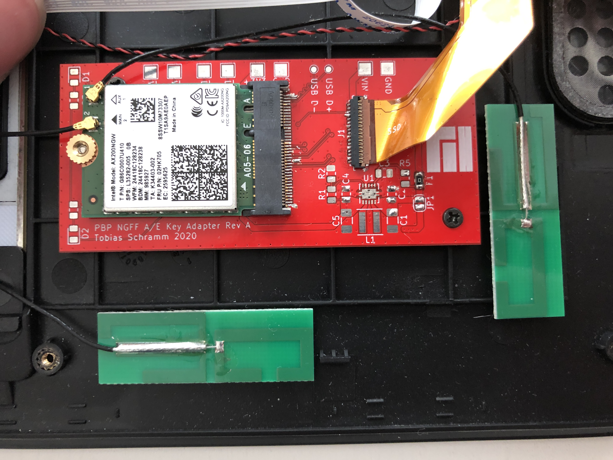

Pinebook Pro M.2 WiFi adapter
=============================

#### Overview

The M.2 A/E key adapter enables the use of M.2 WiFi cards in the Pinebook Pro ARM laptop.  

This adapter was designed as a replacement for the available [NVMe M.2 (M-key) adapter](https://store.pine64.org/?product=pinebook-pro-m-2ngff-nvme-ssd-interface-adapter).  
It uses the same flat flex cable, mounting screws and mounting position. 

USB is not present on the PBP FFC and needs to be connected manually if required.  
Test points for D- and D+ are present on the PCB.  
Most WiFi+Bluetooth combo cards use USB for Bluetooth, but the PBPs internal UART HCI bluetooth adapter can still be used, even after disabling the SDIO WiFi kernel module.  

#### Tested cards

All testing was done using Manjaro ARM, kernel 5.6 and 5.7-rc1. 

Card | Test result
--- | ---
Intel AX200NGW | Works very well, stable, requires additional firmware.
Atheros QCA6174A | Kernel panic at boot, not recommended.

Pull requests with additional test results welcome. 

#### Bill of materials

The board offers an additional footprint for a switch-mode regulator to guarantee a stable 3.3V supply for the M.2 card. 
In our testing this wasn't required and can be left unpopulated. The only required components are the 2 connectors and either a 0805 SMD fuse or 0 ohm resistor at F1.

The PCB should be manufactured as a **1.0mm thick** FR4 board. 

[Interactive BOM](https://tobleminer.github.io/PBP-NGFF-A-E-adapter/ibom.html)

| Design. | Description | Part No.           | Links  |
| ----- |:-------:|:-------------:| -----:|
| J1 | FFC conn. | Hirose FH26W-35S-0.3SHW | [Datasheet](https://www.mouser.de/datasheet/2/185/FH26_CL0580-2410-2-60_2d-1614872.pdf) \| [Mouser](https://www.mouser.de/ProductDetail/hirose-electric/fh26w-35s-03shw60/?qs=vcbW%252b4%252bSTIqfjIQXayKHZQ==&countrycode=DE&currencycode=EUR) |
| J2 | M.2 E-key | Amphenol MDT275E02001 | [Datasheet](https://www.mouser.de/datasheet/2/18/Amphenol_CMDTXXXXXX001-4-1157232.pdf) \| [Mouser](https://www.mouser.de/ProductDetail/fci-amphenol/mdt275e02001/?qs=lrCDz5EUXIYT3rGac7uMeg==&countrycode=DE&currencycode=EUR)  |